本系统为基于ssm的公司工资管理系统：

源码下载地址：http://www.manoncode.cn/details?id=39

技术框架：ssm+layui+jquery+mysql+echarts等 
项目介绍： 
	本系统分为二种用户： 
	管理员：员工管理，部门管理，岗位管理，职称奖金管理，工龄奖金管理，工资项管理，月考勤管理，工资管理一级图表展示工资信息等菜单 
	员工：个人信息，考勤管理以及工资管理等 
	本系统在idea中运行配置tomcat的项目应用名为；ssm_esms,员工登录入口为/，管理员登录入口地址需要加上admin.do 
admin密码为admin 
员工密码为:123456 

CSDN博客地址：[基于ssm的公司工资管理系统](https://blog.csdn.net/mataodehtml/article/details/115010999)

运行视频地址：[基于ssm的公司工资管理系统](https://www.bilibili.com/video/BV1K64y1i7yu)

截图：

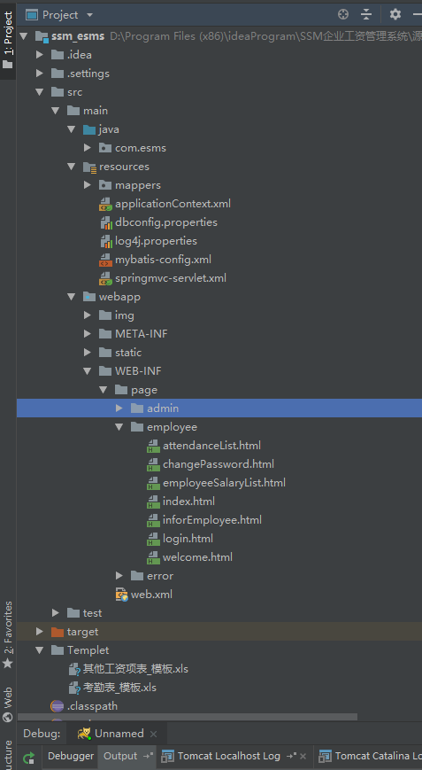

管理员：

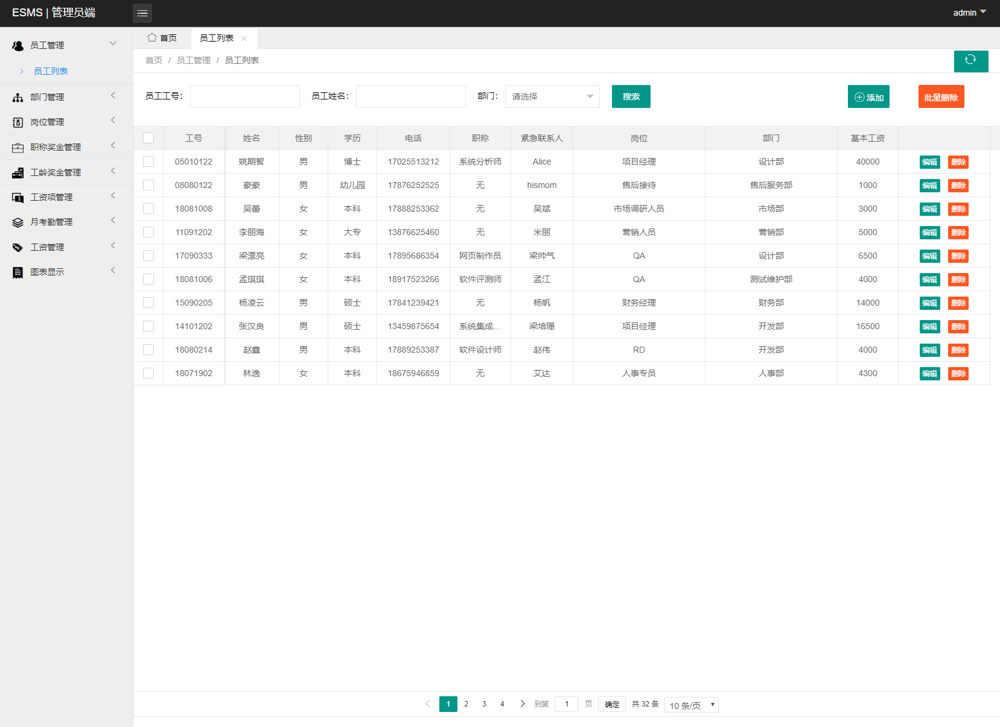

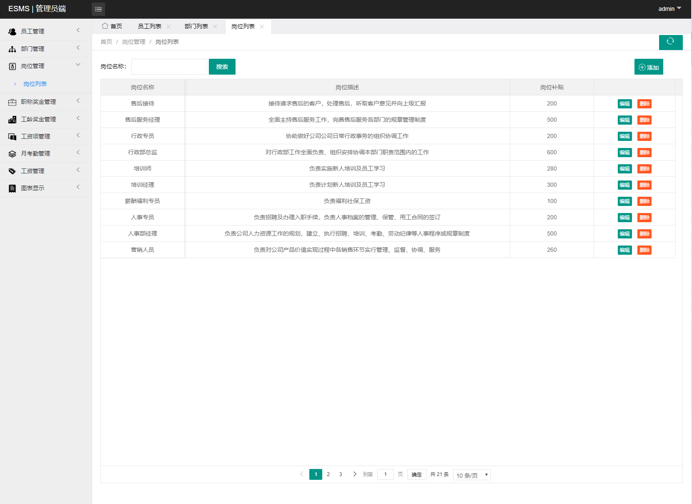

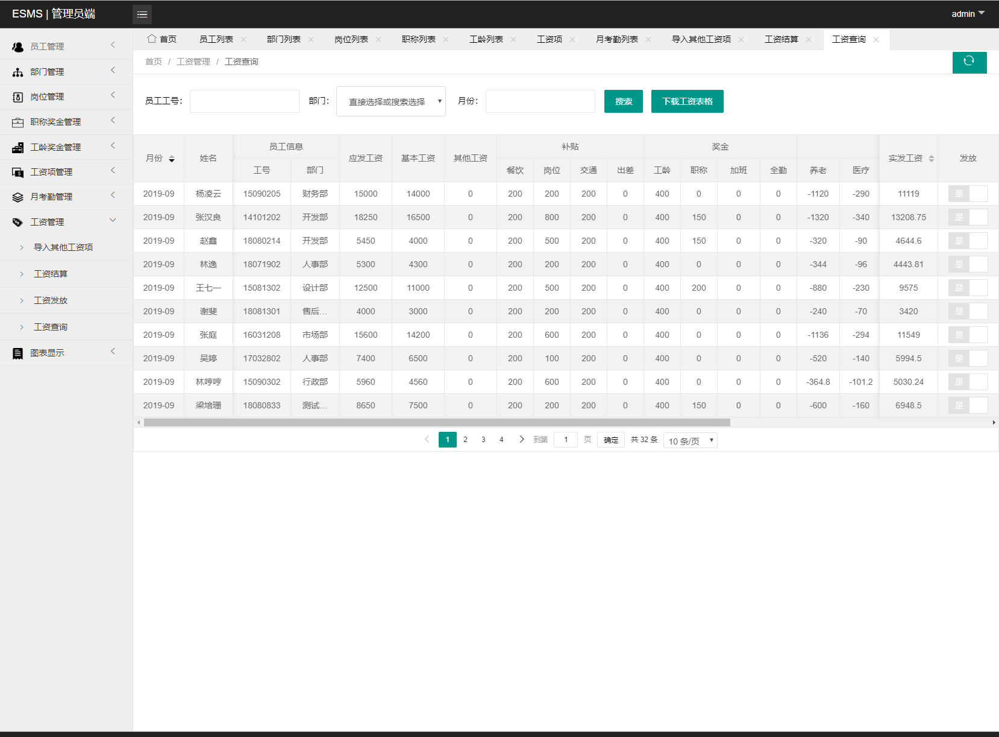

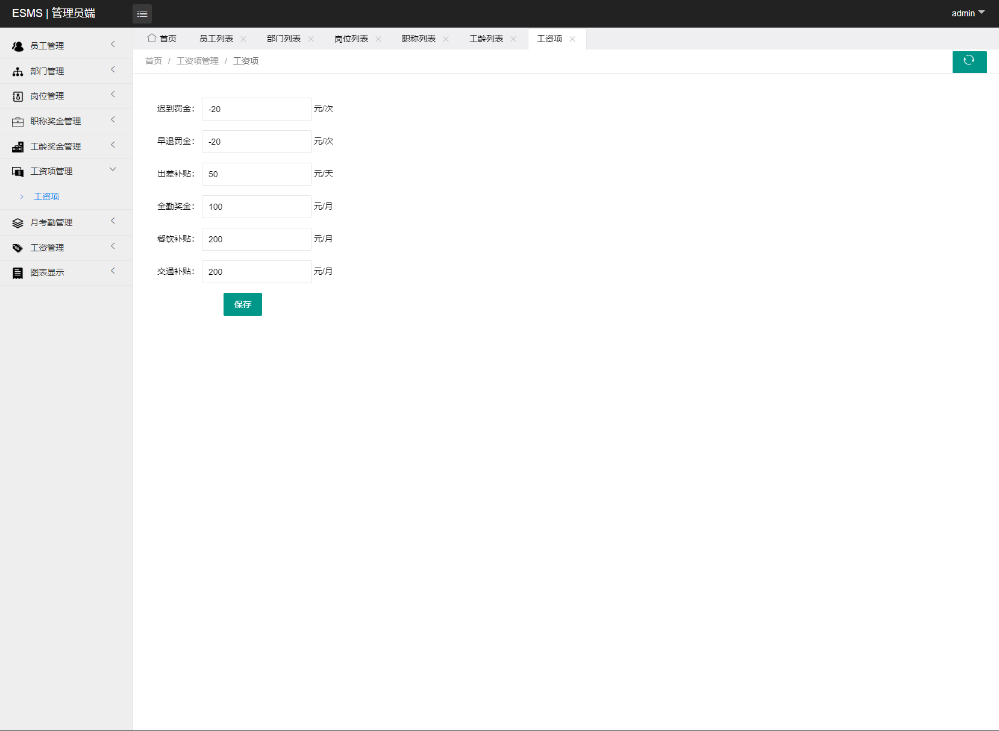

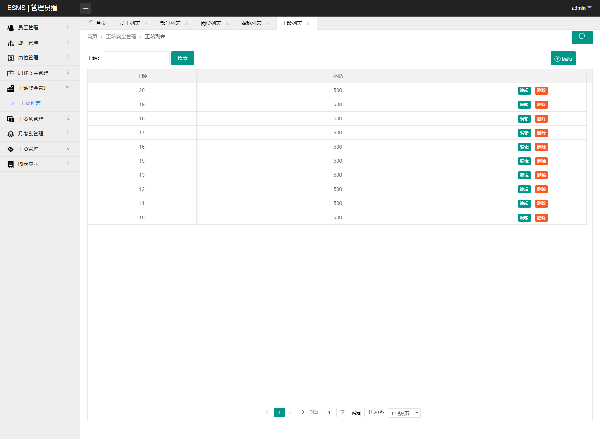

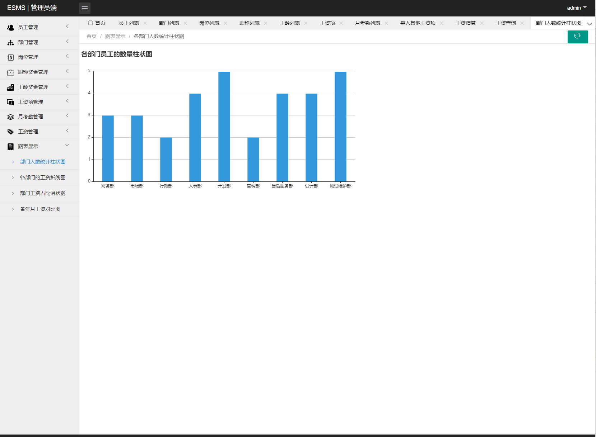

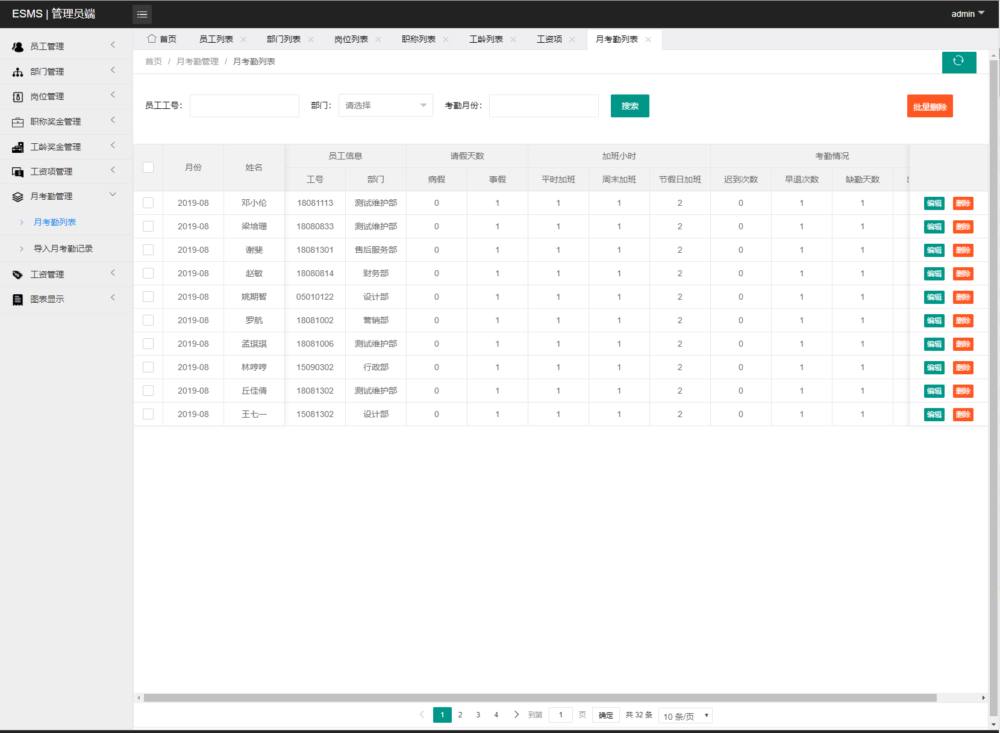

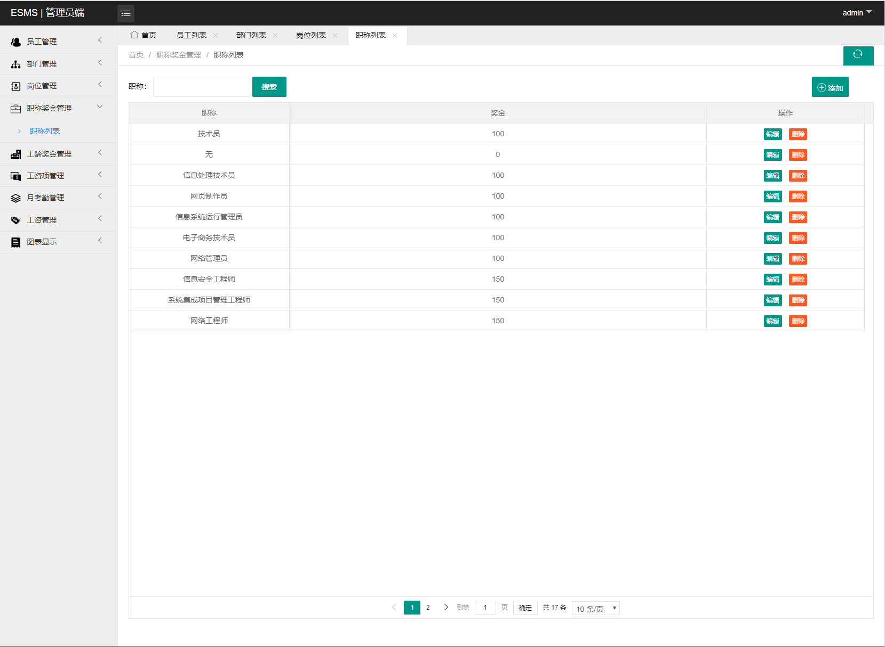

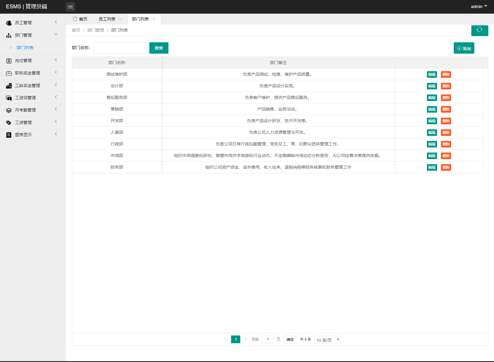

员工：

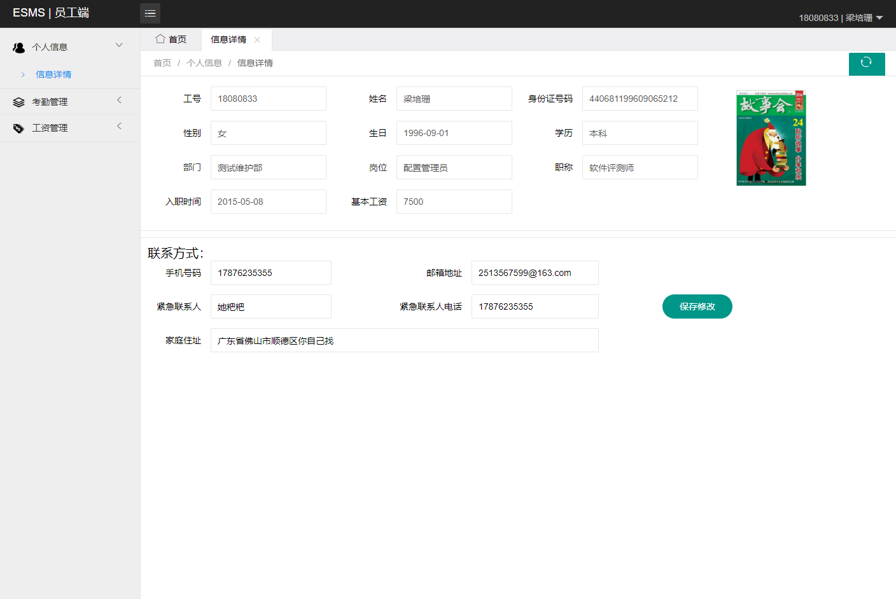

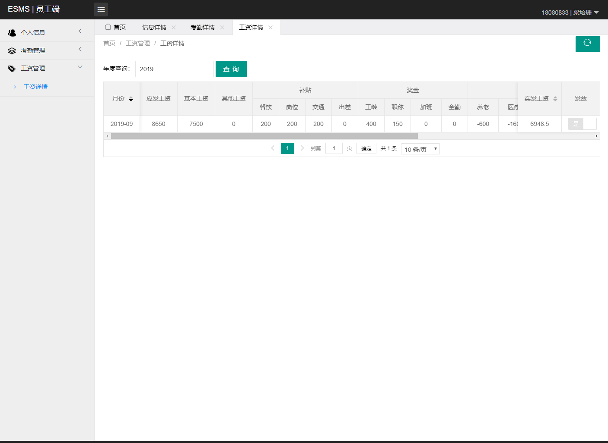

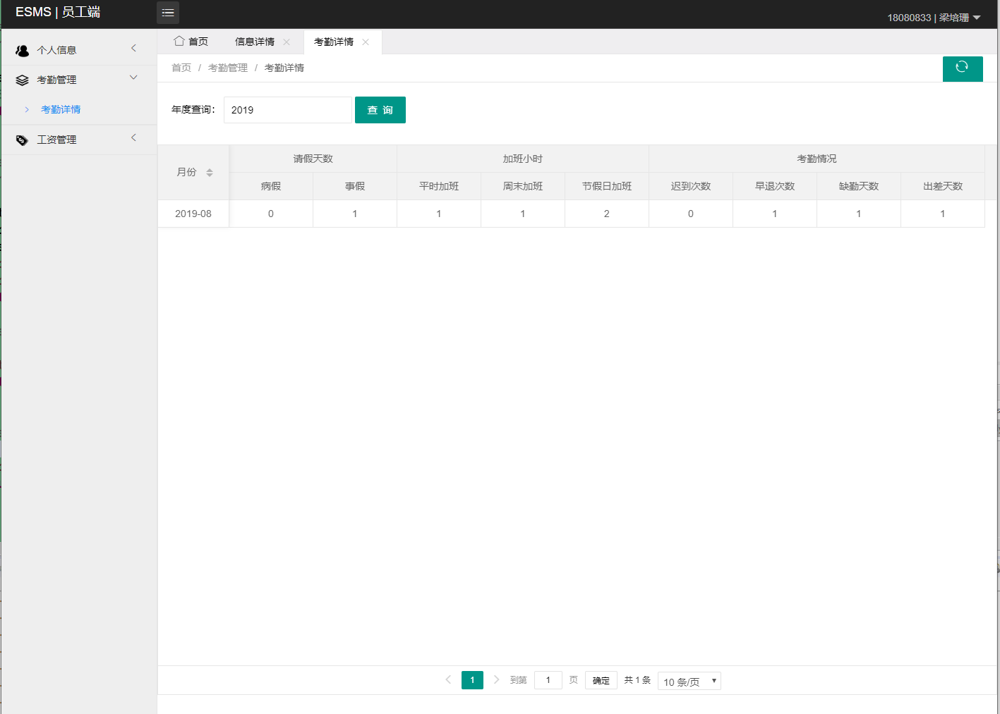
